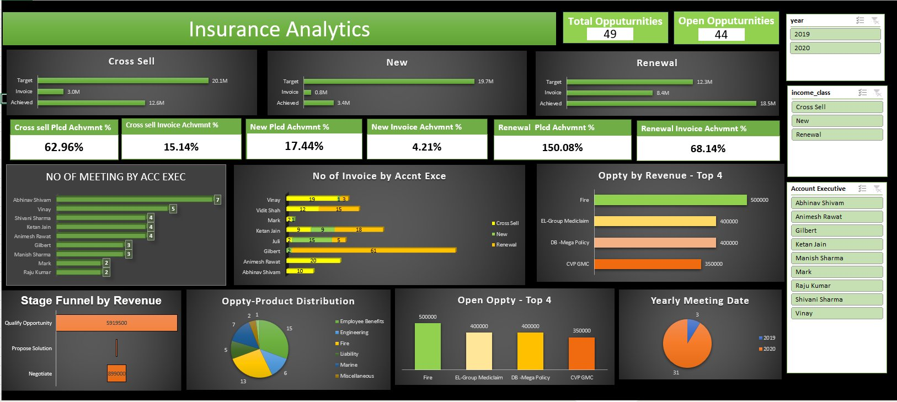
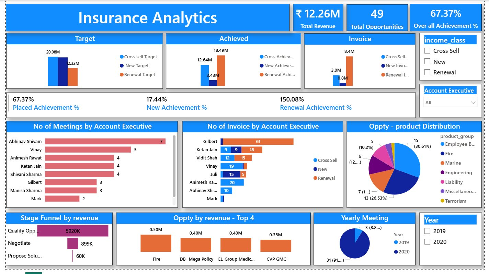
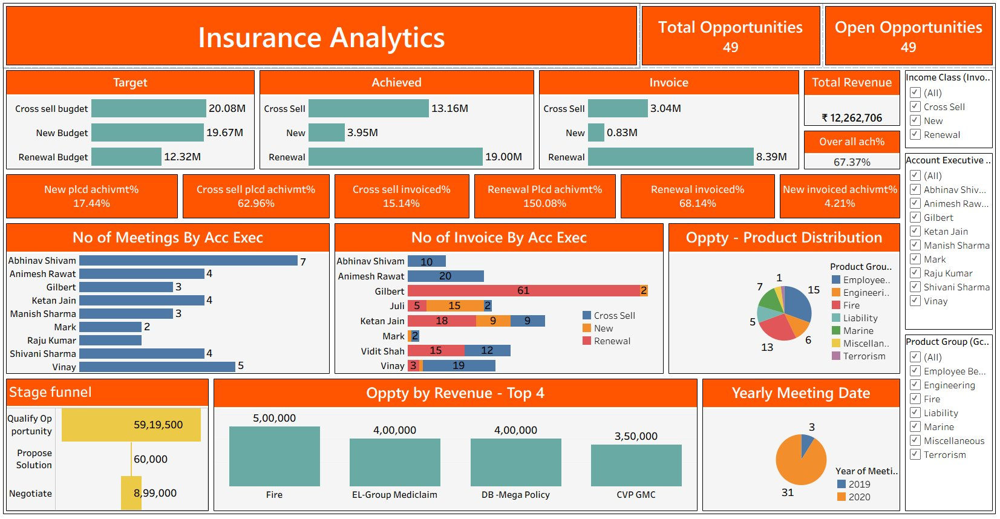

# 📊 Insurance Analytics Dashboard
### Branch Performance & Sales Analytics

An end-to-end data analytics project that integrates multi-source insurance business data and delivers interactive dashboards using **Excel**, **SQL**, **Tableau**, and **Power BI** to track KPIs across sales, revenue, and opportunity streams.

---

## 🎯 Project Objective

To build an **Insurance Analytics Dashboard** that provides insights into:
- Sales performance across branches
- Revenue generation trends
- Opportunity tracking and funnel analysis
- KPI monitoring at branch and account executive level

---

## ❗ Business Problem

Organizations in the insurance domain often face:
- Fragmented data stored across multiple systems
- Lack of real-time performance monitoring
- Difficulty tracking targets vs. achievements
- Limited visibility into branch-level and employee-level KPIs

---

## ✅ Solution

Developed interactive dashboards using **Excel, SQL, Tableau, and Power BI** to centralize data and enable data-driven decision making across all business streams.

---

## 🏗️ Project Architecture

```
Multiple Data Sources
        ↓
┌─────────────────────────────────────┐
│  Target Sheets                      │
│  Brokerage & Fees Data              │
│  Invoice Reports                    │
│  Meetings Data                      │
│  Opportunity Reports                │
└─────────────────────────────────────┘
        ↓
Data Cleaning & Transformation (Excel + SQL)
        ↓
┌──────────────┬──────────────┐
│   Tableau    │   Power BI   │
│  Dashboard   │  Dashboard   │
└──────────────┴──────────────┘
        ↓
Business Insights & Recommendations
```

---

## 🛠️ Tools & Purpose

| Tool | Purpose |
|---|---|
| **Excel** | Data cleaning, formatting, validation & preliminary KPI calculations |
| **SQL** | Data storage, relational tables, transformation & analytics queries |
| **Tableau** | Interactive visual dashboards & trend analysis |
| **Power BI** | Advanced analytics with KPI cards & funnel visualization |

---

## 📂 Data Sources Used

| Source | Description |
|---|---|
| **Target Sheets** | Branch-wise targets for New Business, Cross-Sell & Renewal |
| **Brokerage & Fees Data** | Broker details, commission, channel performance |
| **Invoice Reports** | Premium amounts, policy numbers, payment status |
| **Meetings Data** | Client meetings, follow-ups, conversion rates |
| **Opportunity Reports** | Leads, pipeline stages, win/loss status |

---

## 📊 KPIs Tracked

### Revenue KPIs
- Total Revenue
- Cross-Sell Target vs Achieved
- New Business Target vs Achieved
- Renewal Target vs Achieved

### Performance KPIs
- Placed Achievement Percentage
- Invoice Achievement Percentage
- Number of Meetings by Account Executive
- Number of Invoices by Account Executive

### Opportunity KPIs
- Total Opportunities
- Open Opportunities
- Closed Won Opportunities
- Opportunity Conversion Ratio

---

## 🔧 Tool-wise Breakdown

### 📗 Excel
- Data formatting and validation
- KPI calculations using pivot tables & VLOOKUP/XLOOKUP
- Preliminary data analysis
- Initial dashboard for quick insights

### 🗄️ SQL
- Created relational tables with primary & foreign keys
- Wrote queries for revenue analysis by product
- Opportunity stage tracking
- Performance analysis by account executive

### 📉 Tableau
- Opportunity revenue analysis
- Meetings by account executive
- Product distribution
- Opportunity funnel stages
- Easy filtering and drill-down analysis

### 📈 Power BI
- Interactive KPI cards
- Opportunity funnel visualization
- Revenue breakdown by product
- Overall achievement percentage tracking
- Total revenue & total opportunities view

---

## 📸 Dashboard Screenshots

### 📗 Excel Dashboard


---

### 📈 Power BI Dashboard


---

### 📉 Tableau Dashboard


---

## 💡 Key Business Insights

- ✅ **Renewal business** achieved **150.08%** of target — highest performance across all streams
- 🔥 **Fire insurance** generated the **highest opportunity revenue** (₹5,00,000)
- 📊 **Total Revenue: ₹12.26M** with **67.37% overall achievement**
- ⚠️ **New Business** achievement at only **17.44%** — flagged for strategic review
- 📉 Certain account executives require **performance improvement**
- 🎯 Cross-sell opportunities at **62.96%** placement — need further push

---

## 📌 Recommendations

1. Increase focus on **cross-sell strategies** to tap untapped revenue
2. Improve **conversion of qualified opportunities** from pipeline
3. Encourage more **client meetings** by account executives
4. Use dashboards for **weekly performance monitoring**

---

## ⚠️ Challenges Faced

- Data inconsistency across multiple datasets
- Data cleaning and transformation complexity
- Integrating multiple tools into a unified workflow
- Ensuring KPI calculation accuracy across sources

---

## 📚 Skills Demonstrated

- ✅ Multi-source Data Integration
- ✅ Data Cleaning & Wrangling (Excel + SQL)
- ✅ KPI Development & Business Metrics
- ✅ Dashboard Design (Tableau + Power BI)
- ✅ SQL Query Writing & Database Design
- ✅ Insight Generation & Business Reporting
- ✅ Analytical Thinking & Data Storytelling

---

## 👩‍💻 Author

**Nishita Thakur**
Entry-Level Data Analyst | SQL | Power BI | Tableau | Excel
[LinkedIn](https://www.linkedin.com/in/nishitathakur-/) · [GitHub](https://github.com/YOUR_USERNAME)

---

## 📄 License

This project is open-source and available under the [MIT License](LICENSE).
